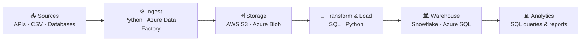

<div align="center">

<!-- Animated header banner -->


<!-- Typing animation -->
<a href="https://git.io/typing-svg">
  
</a>

<br/><br/>

<!-- Social badges -->
[](https://iabdullahkhan.me)
[](https://www.linkedin.com/in/abdullahkhan5939/)
[](https://github.com/Abdullah2139)


</div>

---

## 👨‍💻 About Me

```python
class Abdullah:
    name        = "Abdullah Khan"
    degree      = "Computer Systems Engineering, UET Peshawar"
    focus       = ["Data Engineering", "ETL Pipelines", "Data Warehousing", "Analytics"]
    cloud       = ["Azure", "AWS", "Snowflake"]
    languages   = ["Python", "SQL"]
    learning    = ["Apache Spark", "dbt", "Azure Data Factory orchestration"]
    currently   = "Open to Associate Data Engineer and entry-level DE / Analytics roles"
    fun_fact    = "I built an AI traffic violation detector for my final year project 🚦"
```

I'm a Computer Systems Engineering graduate who loves the **full data journey**: ingesting data from APIs and databases, transforming it with SQL and Python, and loading it into cloud warehouses where it becomes real insight.

---

## 🛠️ Tech Stack

<div align="center">

### ☁️ Cloud & Data Warehousing


### 🐍 Languages & Databases


### 🔧 Tools & Frameworks


### 🤖 Applied AI / Computer Vision


</div>

---

## 🔄 How I Build Pipelines



---

## 🚀 Featured Projects

<table>
  <tr>
    <td width="50%" valign="top">
      <h3>🏗️ Data Engineering Projects</h3>
      <p><strong>ETL/ELT Pipelines · Cloud · Warehousing</strong></p>
      <p>End-to-end data engineering projects:</p>
      <ul>
        <li><b>Azure ETL pipeline</b></li>
        <li><b>Snowflake data warehouse</b> (Instacart dataset)</li>
        <li><b>E-commerce pipeline</b> on Azure SQL</li>
        <li><b>Last.fm API ETL</b> pipeline with AWS S3</li>
      </ul>
      <p>
        
        
        
        
        
      </p>
      <a href="https://github.com/Abdullah2139/data-engineering-projects">
        
      </a>
    </td>
    <td width="50%" valign="top">
      <h3>🗃️ SQL Projects</h3>
      <p><strong>Analytics · Query Optimization</strong></p>
      <p>Hands-on SQL work covering aggregations, joins, window functions, CTEs and reporting queries, the fundamentals every data role demands.</p>
      <p>
        
        
        
      </p>
      <a href="https://github.com/Abdullah2139/sql-projects">
        
      </a>
    </td>
  </tr>
  <tr>
    <td width="50%" valign="top">
      <h3>🚦 AI Traffic Violation Detector</h3>
      <p><strong>Final Year Project · Computer Vision + Django</strong></p>
      <p>Traffic monitoring system that detects violations, reads number plates via OCR, and logs incidents to a web dashboard with automated PDF reporting.</p>
      <p>
        
        
        
        
        
      </p>
      <a href="https://github.com/Abdullah2139/traffic-light-violator-fyp">
        
      </a>
    </td>
    <td width="50%" valign="top">
      <h3>💼 Portfolio Projects</h3>
      <p><strong>Analytics · Practice</strong></p>
      <p>Analytics projects built for practice across different technologies, showing how I learn and experiment.</p>
      <p>
        
        
      </p>
      <a href="https://github.com/Abdullah2139/portfolio-projects">
        
      </a>
    </td>
  </tr>
</table>

---

## 🗺️ Expertise Map

```
Python                    ████████████████░  Proficient
SQL & Analytics           ███████████████░░  Intermediate-Advanced
ETL Pipeline Design       ███████████████░░  Intermediate-Advanced
Data Engineering          ██████████████░░░  Intermediate
Azure (ADF, Blob, SQL DB) ████████████░░░░░  Intermediate
Snowflake & DWH Design    ████████████░░░░░  Intermediate
```

---

## 📊 GitHub Stats

<div align="center">


</div>

---

## 🌱 What I'm Working On

- 📦 Expanding my **data-engineering-projects** repo with **Apache Spark** and **dbt** projects
- 📈 Deepening my knowledge of **Azure Data Factory** orchestration patterns
- 🔍 Exploring **dbt + Snowflake** for analytics engineering workflows

---

## 🤝 Let's Connect

<div align="center">

I'm actively looking for **Associate Data Engineer**, **Data Engineering** and **Analytics** roles. If you're building data infrastructure, I'd love to talk!

[](https://iabdullahkhan.me)
[](https://www.linkedin.com/in/abdullahkhan5939/)
[](https://github.com/Abdullah2139)

</div>

---

<div align="center">


*"Data is the new oil, and pipelines are how you refine it."*

</div>
