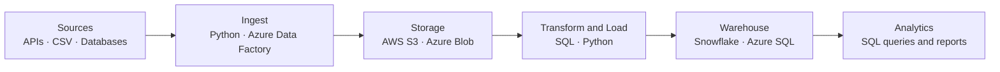

# Abdullah Khan

### Data Engineer · Computer Systems Engineering Graduate (UET Peshawar)

*I build ETL pipelines and cloud data warehouses that turn raw data into reliable, analysis-ready tables.*

---

## About

I'm a Computer Systems Engineering graduate focused on **data engineering and analytics**. I work across the full data journey: ingesting data from APIs and databases, transforming it with SQL and Python, and loading it into cloud warehouses on **Azure**, **AWS** and **Snowflake**.

| | |
|---|---|
| **Focus** | Data Engineering · Analytics |
| **Education** | B.Sc. Computer Systems Engineering, UET Peshawar |
| **Core stack** | SQL · Python · Azure · Snowflake · AWS |
| **Looking for** | Associate / entry-level Data Engineering and Analytics roles, and internships |

---

## Tech Stack

**Cloud and warehousing**

**Languages and databases**

**Tools**

**Applied ML (supporting skill):** YOLOv11 · OpenCV · EasyOCR · PyTorch

---

## How I Build Pipelines

---

## Featured Projects

### Data Engineering Projects
**[View repository](https://github.com/Abdullah2139/data-engineering-projects)**

End-to-end pipeline and warehousing projects:

- **Azure ETL pipeline:** extract, transform and load workflow on Azure
- **Snowflake data warehouse (Instacart dataset):** warehouse design and SQL analysis in Snowflake
- **E-commerce data pipeline:** orders flowing into Azure SQL, ready for analysis
- **Last.fm API ETL pipeline:** live API ingestion with Python, stored in AWS S3

`Azure` `Snowflake` `AWS S3` `Python` `SQL`

### SQL Projects
**[View repository](https://github.com/Abdullah2139/sql-projects)**

Analytics-focused SQL work: aggregations, joins, window functions, CTEs and reporting queries.

`SQL` `PostgreSQL`

### AI Traffic Violation Detector (Final Year Project)
**[View repository](https://github.com/Abdullah2139/traffic-light-violator-fyp)**

A computer vision system that detects traffic violations, reads number plates with OCR, and logs incidents to a web dashboard with PDF reporting. It shows I can take a project from raw data to a working product.

`YOLOv11` `OpenCV` `EasyOCR` `Django` `SQLite`

### More
**[Analytics and practice projects](https://github.com/Abdullah2139/portfolio-projects)**

---

## Currently Learning

- Apache Spark
- dbt with Snowflake for analytics engineering
- Azure Data Factory orchestration patterns

---

## Let's Connect

I'm looking for **Associate Data Engineer**, **Data Engineering** and **Analytics** roles. If your team is building data infrastructure, I'd love to talk.

